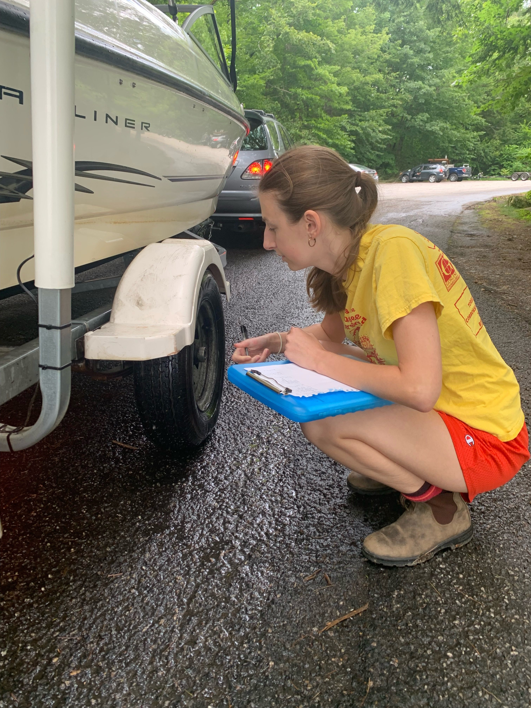

# Insights for The Friends of the Cobbossee Watershed

# Introduction
For my capstone, I wanted to create a project that would have a positive real-world impact. I reached out to The Friends of the Cobossee Watershed offering my services as a data scientist and the organization took me up on this offer.

Friends of the Cobbossee Watershed (FOCW) is an environmental nonprofit dedicated to protecting Cobbossee Lake and the surrounding watershed district. FOCW is currently planning their 2024 budget and determining what to pay their seasonal summer employees as the minimum wage in Maine increases. The organization would like to determine how much labor costs would increase with different pay increases as they consider further increasing their minimum pay beyond the minimum wage in order to be competitive with other businesses.The goal of this project is to utilize a combination of predictive modeling through maching learning and data analysis techniques to provide meaningful insights to the nonprofit.

# Background
"The Friends of the Cobbossee Watershed is a 501©(3) nonprofit located in Winthrop, Maine. The Friends focus on community engagement, conservation, and education to protect the lakes, ponds, and streams in the Cobbossee Watershed." (Organization Website: https://watershedfriends.com/) The FOCW's conservation work is focused into 2 missions: combating runoff pollution and controlling the spread of invasive species. 

## Courtesy Boat Inspection (CBI) Program
Boaters can spread invasive species from one body of water to another when plants (or other species) remain on a boat when it is removed from the water. The CBI program is part of FOCW’s effort to combat the existence and introduction of invasive species to the lakes and ponds of the Cobbossee Watershed. During a courtesy boat inspection, one of FOCW’s trained Courtesy Boat Inspectors check boats and equipment for aquatic plants and educate boaters on how to properly wash boats and equipment to prevent the spread of invasive species. 

image source: https://watershedfriends.com/programs/conservation/invasive-aquatic-species/courtesy-boat-inspection/

Over the past few years, FOCW has covered approximately 80% of the shifts it aimed to staff for it's CBI program. The organization's goal has been to staff the 10 public boat launches present in the watershed district during every weekend from Memorial Day to Labor Day as well as holidays. The Friends of the Cobbossee Watershed staff also cover some weekday non-holiday shifts. Volunteer trained inspectors cover some shifts as well though most shifts are staffed by paid inspectors. 

# Project Goals
The organization asked me to focus my analaysis on the Courtesy Boat Inspection Program. They were interested in projections for the increase in cost in 2024 given different scenarios. My primary goal was to predict how many more Courtesy Boast Inspections the organization would be able to conduct given different scenarios and then calculate the added cost of the increased shift coverage.
1. Develop a model than can predict the number of inspections that would be conducted on a given shift
2. Use this model to project the total number of inspections in 2024 based on different scenarios
3. Create projections of both labor costs and the number of inspections for multiple scenarios
4. Identify times and locations to focus on when increasing shift coverage in order to maximize the number of inspections/ cost

# Data Dictionary
|Feature|Type|Description|
|---|---|---|
|SITE_NAME|object|The name of the site the inspector is based at| 
|DATE1|object|Date as an object variable| 
|DAY_OF_WEEK|object|The Day of the Week| 
|INSPECTOR_ID|int|The unique identifier of the inspector| 
|PAY_VOL|int|0 if volunteer, 1 if paid employee| 
|SHIFT_START|object|Time the shift began| 
|SHIFT_END|object|Time the shift ended| 
|TOTALINSP|float|The number of inspections conducted during the shift| 
|NUMINVASIVE|float|The number of invasive species found during the shift| 
|TOWN|object|The name of the town| 
|WATERBODY|object|The name of the waterbody the inspector is stationed at| 
|SHIFT_LENGTH|float|The length of the shift in minutes| 
|DATE|object|The date reformatted as date-time variable| 
|month|int|The month| 
|year|int|The year| 

# Data Cleaning & EDA
The 2023 CBI shift data was downloaded as a csv from a dashboard maintained by the Maine Department of Environmental Protection found at this link: https://maine.maps.arcgis.com/apps/dashboards/de2b7d59cab1437187eb49ac26f1d852. Data for 2021 and 2022 is not publicly available to be downloaded so initially this data was scraped using the code found in the Webscraping notebook in the Scratchwork folder. However, the data coordinator then sent over csv files with the 2021 and 2022 data which contained more variables than in the scraped data. Therefore, it was more convenient to use the csv files provided by the Department of Environmental Protection for EDA and modeling rather than the webscraped data. 

### Weather Data
The weather is a major factor for whether or not folks choose to go out on their boats. As weather data was not originally included in CBI data, weather data for 2021, 2022, and 2023 for Winthrop, ME was requested from NOAA. The raw weather data was uploaded to the data folder as weather.csv. For the dates in the CBI shift dataset, the three weather variables contained some missing observations. In order to avoid dropping these observations completely, a variety of imputation strategies was tried. Backfilling was found to be the most successful for modeling. 

### Shift Data
Luckily, very little data cleaning was necessary. First, variables were dropped. The names of the inspectors aren't necessary and were dropped to preserve employee privacy. The number of invasive species identified, the number of motorized vehicles, and the number of non-motorized vehicles are all variables that would not be known before a shift begins. These variables are actually dependent on the number of inspections (the dependent variable in the model) rather than predictive of this variable and were all dropped as well. Comments, IDs of the site, and longitutde/ latitude are all redundant with the site_name and were also dropped. The only other significant data cleaning steps were to match variable and value names from 2022 to 2023 as the names in the datasets changed during that times. All Data Cleaning steps were conducted in the Data Cleaning and Feature Engineering notebook.

### Exploratory Data Analysis Initial Findings
The most notable findings during the initial exploration of the data were that none of the numeric variables were highly correlated with the total number of inspections but that there were significant trends related to the location (site) of the shift and the time of day (day_part) when the shift began. Given the general lack of significant relationships, I believed that the most successful models would only be able to account for some of the variation in the total number of inspections per shift and did not expect high R2 scores or other metrics to be very optimized in my final model. Most EDA steps including visualizing the data, graphing correlations, and examining numeric summaries of each variable were conducted in the EDA notebook.

# Feature Engineering
#### Capturing impact of time of day
In the raw data, shift start times and shift end times were included in a datetime format. These times were used to develop new variables SHIFT_START_CATEGORY and SHIFT_END_CATEGORY which were the part of the day (early morning, morning, afternoon etc.) when a shift started or ended. Using the day part rather than the specific time significally improved the performance of various models.

#### Handling Inspector_ID:
Some inspectors are more experienced than others, returning from prior years, working more shifts, and receiving higher pay. According to the program coordinator, there were some issues in 2023 with inspectors not inspecting all present boats. In order to capture any impact from the inspector assigned to the shift, an ID_COUNT variable was engineered. The ID_COUNT is the number of shifts the inspector id is assigned to in the dataset and was used as a proxy variable for experience.

#### Holidays
A binary holiday variable was engineered representing whether the shift ocurred on a national holiday or Father's Day or the weekend closest to the holiday.

# Developing a Model to Predict Total Inspections
I followed an iterative model development process. I first created a baseline model to compare my models to. The baseline had an R2 of 0 and was a poor model. I then split my data into a training set and testing set in order to evaluate my models' performance. I created benchmark Linear Regression, Random Forest, KNN, Extra Trees, Ada Boost, and Gradient Boost models. The Linear Regression and Random Forest models were initially the most promising. I then added the weather data to the shift data and re-ran all of the models. This resulted in a significant improvement to the model performance. Next, I added each of the engineered variables and then re-ran the models. Each variable improved at least one of the model types a little and the most significant improvements came for the engineering of the categorical day_part variables. Further engineering the day_part variables to include binary variables for whether a shift covered that part of the day worsened the models. 

After experimenting extensively with the use of feature engineering, I began to focus on parameter optimization. I use randomized search on each model type and then focused in on the Linear Regression, Random Forest, and Gradient Boost models. After more randomized searching and limited gridsearching, I was able to train a Gradient Boost model with a training R2 score of .634 and a test score of .549. I retrained this model on all of the data and the retrained model had an R2 score of .61. I pickled this model and pickled the pre-processing One-Hot Encoding Step so that I could use this model to make predictions.

Model development took place in the Modeling notebook. It is not recommended to run all cells in this notebook due to the use of randomized searches and grid searches.

# Deploying the Model to Create Projections
I deployed the model on multiple what-if scenarios to gain insights into how to optimize the process of increasing shift coverage. I created these scenarios by examining shifts that were not covered in 2023. In each scenario I simulated covering 100 extra shifts. In the first scenario, all shift variables were filled randomly based on the proportions of values in the original dataset and then merged with the weather data for that date. In the second scenario, start time was set to be 7 am for a 4 hour shift. In the third scenario, the start time remained the same but for an 8 hour shift. In the fourth scenario, I simulated 8 hour shifts that begin at 9:30am (the approximate mean start_time in the 2023 data). 

### Scenario Creation Process
1. Identify shifts that were not covered in 2023
2. Create a dataset of just the uncovered shifts
3. Develop each step of the process of filling this data (merging with weather, setting start times, feature engineering)
4. Use these steps to create a function to fill in the values of each scenario

### Prediction Process
1. Use the pickled model to predict values for the what-if scenarios
2. Sum the predictions
3. Use bootstrapping to create a prediction_interval (95%)

# Results & Conclusions

The time a shift begins and the location of the shift can have a signficant impact on the number of expected inspections, however the busiest location was fully staffed in 2023 and so this site was not represented in any of the what-if scenarios. The benefit of starting a shift early and catching most boaters as they enter the water seemed to be offset if the shift was too short as the shorter 4 hour shifts had the least efficency. This implies that while 7am to 8 am may be a busy inspection time, boat traffic and as a result inspections may slown down in later morning and pick up again in the afternoon. 

# Reccommendations
- Encourage volunteers to sign up for earlier shifts- and don’t discourage short targeted shifts!
- Focus on staffing the higher volume boat launches first
- Expand weekday shifts when possible
- Increase the base pay rate to hire more staff and cover more shifts
    - Can consider offsetting the costs by decreasing shift lengths
